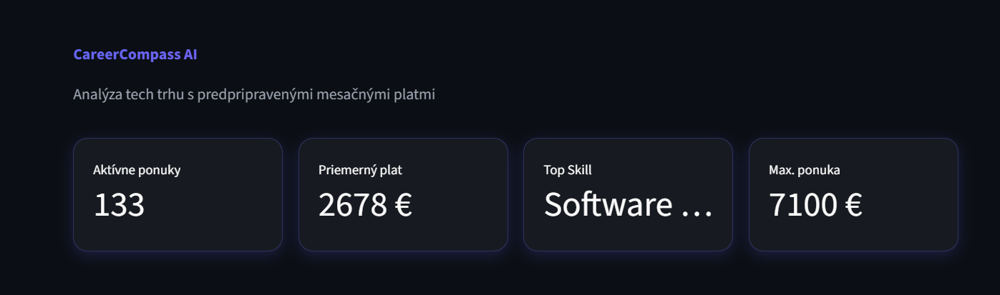
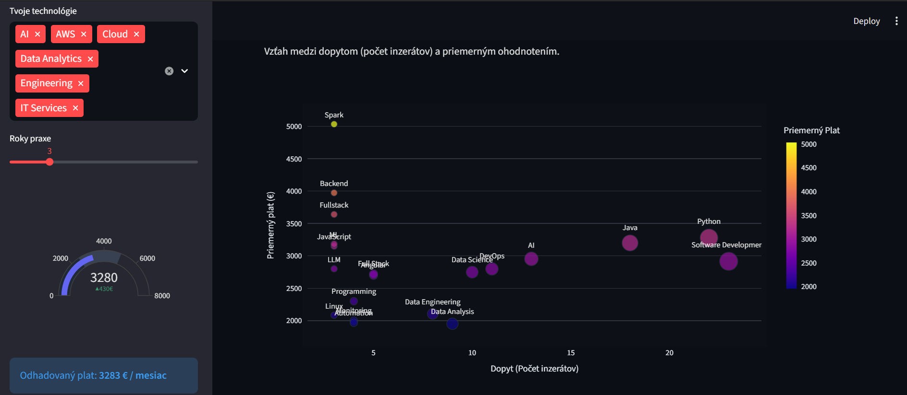
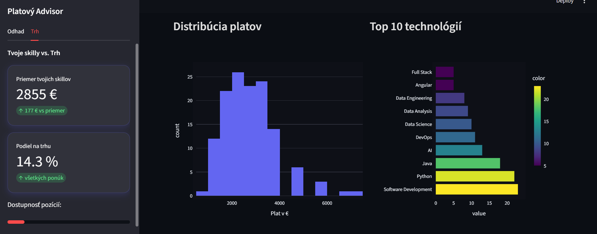

# 🧭 CareerCompass AI

> **Inteligentná platforma na analýzu slovenského tech trhu práce, ktorá premieňa neštruktúrované inzeráty na jasné kariérne dáta.**

## Live Demo
Aplikáciu si môžete okamžite vyskúšať tu: [https://career-compass-ai.streamlit.app/](https://career-compass-ai.streamlit.app/)

---

---

## Problém a Riešenie

Uchádzači o prácu v IT na slovenskom trhu čelia niekoľkým výzvam:
* **Netransparentnosť:** Mnoho inzerátov neuvádza jasné platové ohodnotenie alebo podmienky.
* **Dátový chaos:** Každá firma definuje požiadavky (skills) inak, čo sťažuje porovnávanie.
* **Rýchle zmeny:** Trh sa mení rýchlejšie, než stíhajú zachytávať tradičné prieskumy.

**CareerCompass AI rieši tieto problémy pomocou plne automatizovanej dátovej pipeline a pokročilej AI.**

---

## Čo aplikácia dokáže?

1.  **Automatický zber dát (Scraping):** 2x týždenne (streda a sobota) robot pomocou knižnice Playwright prechádza **Profesia.sk** a sťahuje najnovšie IT ponuky.
2.  **AI Analýza (Gemma 3):** Používam najnovší model **Gemma 3** na extrakciu kľúčových zručností (skills), kategorizáciu pozícií a čistenie neštruktúrovaného textu do formátu JSON.
3.  **Interaktívny Dashboard:** Dáta sú vizualizované v Streamlit dashboarde, kde môžete vidieť:
    * **Dopyt po technológiách:** Ktoré skilly sú momentálne najžiadanejšie.
    * **Platová mapa:** Distribúcia platov podľa rolí a seniority.
    * **Salary Predictor:** Odhad vašej trhovej hodnoty na základe AI analýzy vašich skúseností.

---

## Tech Stack

### **Data & AI Pipeline**
* **Python 3.11+:** Srdce celej logiky.
* **Playwright:** Automatizované prehliadanie webu (scraping).
* **Gemma 3 (Google AI):** Pokročilé NLP na spracovanie textu inzerátov.
* **DuckDB & SQLite:** Rýchla analytická databáza pre ukladanie spracovaných dát.

### **Frontend & Vizualizácia**
* **Streamlit:** Moderné rozhranie pre webovú aplikáciu.
* **Plotly:** Interaktívne grafy a vizuálne metriky.

### **Automatizácia (CI/CD)**
* **GitHub Actions:** Zabezpečuje pravidelný refresh dát 2x týždenne bez potreby manuálneho spúšťania.

---

## Aktuálny stav projektu (MVP)
* **Zdroj dát:** Aktuálne sa zameriavam na **Profesia.sk** (IT sekcia).
* **Kapacita:** Pipeline spracováva stovky inzerátov v každom cykle.
* **Deployment:** Aplikácia beží na Streamlit Cloud a dáta sa automaticky aktualizujú cez GitHub Actions.

---

## Roadmap (Budúcnosť)
* **Viac zdrojov:** Rozšírenie scrapingu o LinkedIn a Indeed.
* **Time-series analýza:** Sledovanie vývoja platov a popularity technológií v priebehu mesiacov.
* **Notifikácie:** Upozornenia na nové ponuky, ktoré presne spĺňajú vaše skill-sety.

---
*Dáta sú aktualizované automaticky 2x týždenne | Posledná aktualizácia: Február 2026*
